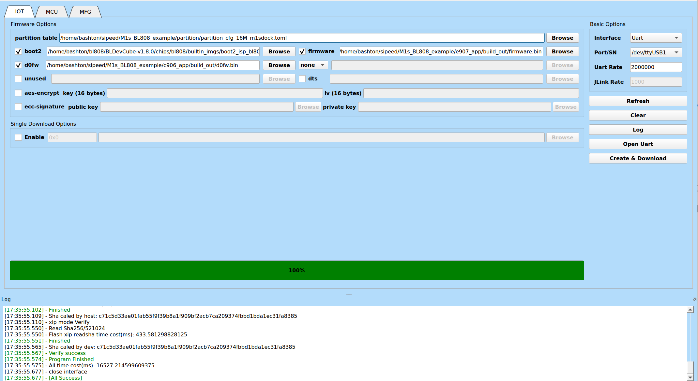

===
M1s
===

This is a small but feature full board from Sipeed:
 * 30 GPIO pins
 * on-board NOR flash (16MB)
 * on-board Wi-Fi / BLE Antenna
 * microSD (SDHC)
 * USB 2.0 HS OTG
 * USB Dual UART (BL702)
 * 1.69in 280x240 display with CTP
 * Analog MEMS mic
 * 2MP MIPI OV2685
 * JTAG

Useful Links
------------
 * https://wiki.sipeed.com/hardware/zh/maix/m1s/other/get_key.html
 * https://www.indiegogo.com/projects/sipeed-maix-new-experience-to-risc-v-aiot-tinyml
 * https://dl.sipeed.com/shareURL/MAIX/M1s/M1s_Dock

Out of the Box
--------------
This board out of the box is flashed with a demo application
in both the D0 and M0 cores. The touch screen will show the LVGL
demo applications and both UARTs provide an interactive shell.

 * /dev/ttyUSB0 -- D0 core
 * /dev/ttyUSB1 -- M0 core

This is the console output for the D0:

.. code-block::

    Starting bl808 now....
    Heap Info: 32701 KB @ [0x0x0000000050210940 ~ 0x0x0000000052200000]
    [OS] Starting aos_loop_proc task...
    [OS] Start c906 xram handle...
    [OS] Starting OS Scheduler...
    init ring:0,tx:0x0000000022020140,rx:0x0000000000000000
    init ring:2,tx:0x0000000022021340,rx:0x0000000022020340
    init ring:3,tx:0x0000000022022540,rx:0x0000000022022340
    init ring:4,tx:0x0000000022022840,rx:0x0000000022022740
    init ring:5,tx:0x0000000000000000,rx:0x0000000000000000
    Init CLI with event Driven
    [cst816x]
        chip_id: 181
        proj_id: 0
        fw_ver: 1
        factory_id: 4

And for the M0:

.. code-block:: 

    Simple Malloc 5120
    custom 0x0000
    flash init 0
    BLSP Boot2 start:Aug 25 2022,15:42:52
    Group=1,CPU Count=3
    ver:6.4_rc6
    user_fw 
    Imgload not found
    SBI not found
    Kernel not found
    Rootfs not found
    DTB not found
    Active PT:0,Age 0
    MFG not found
    entry ID 0 found
    pass param addr 62057c00,len 4
    pass param addr 62057c04,len 236
    pass param addr 62057cf0,len 92
    Boot start
    Media boot main
    R header from 00010000
    ps_mode 0,efuse hbn_check_sign 0
    group[0] offset 00011000 ,core[0] offset 00002000 bootentry 58000000
    group[0],core[1] halt cpu 0
    Counter value=5
    mtimer clock freq:1000000

    blog init set power on level 2, 2, 2.
    [IRQ] Clearing and Disable all the pending IRQ...
    [         0][INFO: hal_boot2.c: 278] [HAL] [BOOT2] Active Partition[149] consumed 596 Bytes
    [         0][INFO: hal_boot2.c:  79] ======= PtTable_Config @0x5004177c=======
    [         0][INFO: hal_boot2.c:  80] magicCode 0x54504642; version 0x0000; entryCnt 6; age 0; crc32 0xD9834983
    [         0][INFO: hal_boot2.c:  86] idx  type device activeIndex     name   Address[0]  Address[1]  Length[0]   Length[1]   age
    [         0][INFO: hal_boot2.c:  88] [00]  16     0         0        Boot2  0x00000000  0x00000000  0x0000e000  0x00000000  0
    [         0][INFO: hal_boot2.c:  88] [01]  00     0         0           FW  0x00010000  0x00000000  0x000f0000  0x00000000  0
    [         0][INFO: hal_boot2.c:  88] [02]  02     0         0         D0FW  0x00100000  0x00000000  0x00200000  0x00000000  0
    [         0][INFO: hal_boot2.c:  88] [03]  05     0         0        media  0x00300000  0x00000000  0x00c00000  0x00000000  0
    [         0][INFO: hal_boot2.c:  88] [04]  11     0         0       unused  0x00f00000  0x00000000  0x00100000  0x00000000  0
    [         0][INFO: hal_boot2.c:  88] [05]  08     0         0      factory  0x00910000  0x00000000  0x00000000  0x00000000  0
    [         0][INFO: bl_flash.c: 170] ======= FlashCfg magiccode @0x22057c18=======
    [         0][INFO: bl_flash.c: 171] mid 		0xEF
    [         0][INFO: bl_flash.c: 172] clkDelay 	0x1
    [         0][INFO: bl_flash.c: 173] clkInvert 	0x3F
    [         0][INFO: bl_flash.c: 174] sector size	4KBytes
    [         0][INFO: bl_flash.c: 175] page size	256Bytes
    [         0][INFO: bl_flash.c: 176] ---------------------------------------------------------------
    [         0][INFO: hal_board.c:1251] [MAIN] [BOARD] [FLASH] addr from partition is 00910000, ret is 0
    [         0][INFO: hal_board.c:1259] [MAIN] [BOARD] [XIP] addr from partition is 58900000, ret is 0
    hal_board_load_fdt_info

    [         0][ERROR: hal_board.c: 944] wifi NULL.
    [         0][ERROR: hal_board.c:1077] bt NULL.
    ------------------------------------------------------------
    Build Version: 8a40141
    Build Date: Nov 12 2022
    Build Time: 17:34:04
    ------------------------------------------------------------
    [OS] Starting aos_loop_proc task...
    ------------------TRNG TEST---------------------------------
    **********TRNG TEST rand[5851f42d]**************
    **********TRNG TEST rand[40b18ccf]**************
    ------------------------------------------------------------
    -------------------->>>>>>>> LWIP tcp_port 61737
    [OS] Start e907 xram handle...
    [OS] Starting OS Scheduler...
    init ring:0,tx:0x00000000,rx:0x22020140
    init ring:1,tx:0x00000000,rx:0x00000000
    init ring:2,tx:0x22020340,rx:0x22021340
    init ring:3,tx:0x22022340,rx:0x22022540
    init ring:4,tx:0x22022740,rx:0x22022840
    init ring:6,tx:0x00000000,rx:0x00000000
    [MTD] >>>>>> Hanlde info Dump >>>>>>
        name media
        id 0
        offset 0x00300000(3145728)
        size 0x00c00000(12288Kbytes)
        xip_addr 0x582f0000
    [MTD] <<<<<< Hanlde info End <<<<<<
    [         2][BUF: bl_romfs.c: 135] 2d 72 6f 6d 31 66 73 2d 00 3a b5 50 e6 cb 22 22 72 6f 6d 20 36 33 36 30 66 62 30 37 00 00 00 00 00 00 00 49 00 00 00 20 00 00 00 00 d1 ff ff 97 2e 00 
    [         3][BUF: bl_romfs.c: 135] 00 00 00 00 00 00 00 00 00 00 00 00 00 00 
    Init CLI with event Driven
    start aos loop... 
    c906
    [MTD] >>>>>> Hanlde info Dump >>>>>>
        name D0FW
        id 0
        offset 0x00100000(1048576)
        size 0x00200000(2048Kbytes)
        xip_addr 0x580f0000
    [MTD] <<<<<< Hanlde info End <<<<<<
    D0FW addr:0x580f0000 size:0x200000
    MM CPU select PLL--->MM CPU select 400Mhz
    UART CLK select MM XCLK--->XCLK select XTAL
    I2C CLK select MM XCLK--->XCLK select XTAL
    SPI CLK select 160Mhz
    MM BUS CLK select 160Mhz
    XCLK select XTAL
    irq handle: 3 reset ev

From the M0 console you are able to start the wifi manager
and connect to a wifi network.

Building the Sample Applications
--------------------------------

The documentation provided https://github.com/sipeed/M1s_BL808_example works
well to get things going.

Building the D0 image:

.. code-block:: 

    cd ~/bl808/M1s_BL808_example/c906_app/

    # Configure environment variables (Executed only once per working environment)
    export BL_SDK_PATH=../M1s_BL808_SDK

    # Compile the hello_world project
    ./build.sh hello_world

Building the M0 firmware:

.. code-block:: 

    cd ~/bl808/M1s_BL808_example/e907_app/

    # Compile the firmware project
    ./build.sh firmware

You will supply BLDevCube three binaries

1. boot2 -- This is bundled with the BLDevCube software

::
    
    BLDevCube-v1.8.0/chips/bl808/builtin_imgs/boot2_isp_bl808_v6.4_rc6/boot2_isp_debug.bin

2. d0fw -- This is in the build_out folder for the c906 app

::

    M1s_BL808_example/c906_app/build_out/d0fw.bin

3. firmware -- This is in the build_out folder for the e907 app

::

    M1s_BL808_example/e907_app/build_out/firmware.bin

Flashing the firmware

1. Place the board in bootloader mode (these are the surface buttons not the side buttons):

  a. Press and hold reset.
  b. Press and hold boot.
  c. Release reset.
  d. Release boot.

2. Start BLDevCube and select BL808.
3. Select IOT and supply the values above.
4. Select /dev/ttyUSB1
5. Select *Create and Download*

