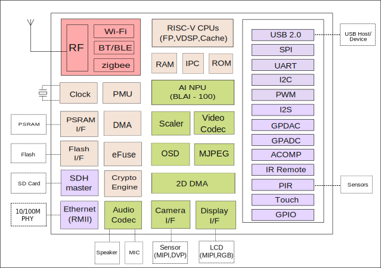

===============================
Notes Developing with the BL808
===============================

.. toctree::
   :maxdepth: 2

   devboards/boards
   jtag

Summary
-------

The BL808 is Bouffalo Lab's higher end AIoT chip, they describe as:

   BL808 is a highly integrated AIoT chipset with Wi-Fi/BT/BLE/Zigbee, Multi-Core CPUs, Audio Codec , Video Codec and AI HW accelerator for high-performance & low-power application.

   Block Diagram

Indices and tables
==================

* :ref:`genindex`
* :ref:`search`
